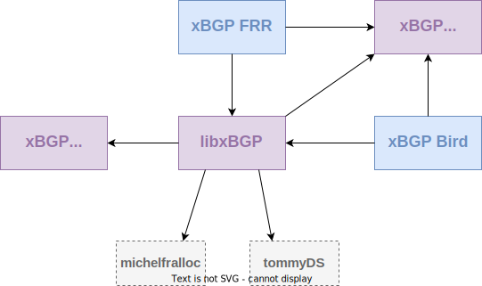

libxBGP
=======

`libxBGP.a`

About
-----

Library containing a set of helpers to
primarily pluginize a routing network
protocol implementation written in C.



`libxBGP.a` is not meant to only work with network
protocols, but with any other program written
in C (e.g. Apache, SSHFS, etc.). In fact, all C
programs can be concerned. 

Building
--------

We rely on several repositories to build libxBGP. A global architecture
is depicted on the above picture

```bash
$ git clone https://github.com/pluginized-protocols/libxbgp.git libxbgp
$ cd libxbgp
$ git submodule update --init --recursive
```

The library you will build is relying on some other
dependencies you need to download before linking
libubpf.a inside a protocol implementation :


- cmake
- json-c 0.12
- CUnit 2.1.3 (to test your build of `libxbgp.a`)
- C compiler supporting gnu11 standard
- POSIX thread and XSI extensions
- libmath (`-lm`)
- libffi

The compilation has been successful with GCC9 and
glibc 2.30.

We use cmake in order to build libxBGP. Just follow these
simple commands to build your version of `libxbgp.a`:
```bash
$ cd libxbgp
$ mkdir build
$ cd build && cmake -DCMAKE_BUILD_TYPE=Release ..
$ make

### run tests ###
$ make test
```

Documentation
-------------

TO BE UPDATED. THE DOCUMENTATION IS OBSOLETE AND
DOES NOT REFLECT HOW TO INTERRACT WITH LIBXBGP ANYMORE !

Everything is on the `docs` folder. The documentation is
written with `sphinx` and `sphinx_rtd_theme`. Hence, to
be able to build the documentation, it is needed to first
install `python-sphinx` either via your package manager
or via pip.

When sphinx has been successfully installed, install the
theme according your Python version. Again, it can be
done via pip, by executing `pip install sphinx-rtd-theme`
or via your package manager (`python-sphinx_rtd_theme`).

When the requirements are satisfied, the below commands
build the documentation to be accessed via a web browser:

```bash
$ cd docs
$ make html
``` 

The output are stored at `./ubpf_tools/docs/build/html`.
The file `index.html` is the root html document.

If you want to build the documentation in another format
such as pdf, simply change the output target when
building with `make` (e.g. `make latexpdf`). However,
the html version of the doc is the only one supported
and tested at the time of writing.

Linking
-------

This library is meant to be linked into the protocol to
be pluginized. The building steps will create a static
library (`libxbgp.a`). Public headers that communicate with
the virtual machine are stored in `./libxbgp/include`.
Therefore, to "pluginize".

Two compatible BGP implementations using libxbgp can be
found on [xbgp_frr](https://github.com/pluginized-protocols/xbgp_frr/tree/stable/7.3-xbgp)
and [xbgp_bird](https://github.com/pluginized-protocols/xbgp_bird/tree/xbgp_compliant).