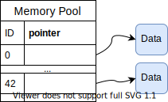

===========
Memory Pool
===========

Sometime, the host implementation is not really flexible. Let's suppose your plugins
implement a new algorithm. Let's take BGP as example. We would like to include the number of
times a BGP peer sends update messages. A way to do that is to put a plugin "A" that monitors
the reception of Update messages.

Imagine also that another plugin "B" want to know
this information to compute some other thing. Since plugins memory cannot be accessed
from one plugin to another, the Memory Pool can be used to leverage those memory
transfer.

How it works
============

The memory pool is a key-value memory as depicted in the image below.

The key is defined as a 32 bits unsigned integer. The representation of this integer is
left at the plugin programmer. Note that this memory is located outside plugins. Which means
that this Memory Pool is initialized on the host implementation and is something not directly
related to the . This memory pool has been designed to ease the modification of a host
implementation without overly modifying its underlying mechanism. With the memory pool, the
programmer can focus its mind on the insertion points it has to include and the API
that communicate with plugins.

As the Memory Pool is included in the host implementation, plugins cannot directly access to the
structure. Instead, you need to provide an underlay mechanism with external API functions to first
access the data, and then copy the data content in the plugin memory.

The code below shows how to initialize one instance of a memory pool. All the memory related to
the memory pool is stored and the heap.

.. code-block:: c

    #define MY_KEY 12

    int custom_int = 56;
    int retrieved_int;
    mem_pool *my_mp = new_mempool();

    if (add_single_mempool(my_mp, MY_KEY, NULL, sizeof(custom_int), &custom_int) != 0) {
        fprintf(stderr, "Failed to add my custom value\n");
    }

    // now lets retrieve the stored value
   retrived_int = get_mempool_u64(mp, MY_KEY);

   // retrieved_int
   assert(custom_int == retrieved_int);
   delete_mempool(my_mp);

Please note that this code chunk cannot be used inside plugins, but rather on the host
implementation side. However, this is not impossible to access to this memory pool on
a plugin.

We will discover how to create a helper function that transfers the content of a value
located in the Memory Pool to the memory plugin. Let's call it `get_state`. We suppose
there is only one single Memory Pool, `global_mempool` through the whole host implementation
stored in the global region of the process.

.. code-block:: c

    uint64_t get_state_u64(context_t *ctx, uint32_t key) {
        if (!global_mempool) return 0;
        return get_mempool_u64(global_mempool, key);
    }

    uint64_t set_state_u64(context_t *ctx, uint32_t key, uint64_t val) {
         if (!global_memory) return 0;
         return add_single_mempool(global_mempool, key, NULL, 8, &val);
    }

Let's now suppose the following plugin "A" as described in the top of this section. Its main task
is to count the number of BGP UPDATE message a peer has sent. For ease of understanding, the
virtual machine will only pass the type of message as the only argument.

.. code-block:: c

    #define UPDATE_MSG_KEY 2

    uint64_t main_plugin_A(bpf_full_args_t *args) {
        int *type_message;
        uint64_t update_message_seen;

        type_message = bpf_get_arg(0, args);
        if (!type_message) return EXIT_FAILURE;

        update_message_seen = get_state_u64(UPDATE_MSG_KEY);
        update_message_seen++;

        return set_state(UPDATE_MSG_KEY, update_message_seen) == 0 ? EXIT_SUCCESS : EXIT_FAILURE;
    }

The plugin B does much the same thing by calling `get_state` to retrieve the state held
inside the Memory Pool.

Through those examples, we pass the data by value. Which means that the value is copied
in the memory pool. Passing by reference could also be used with `add_raw_ptr_mempool`. By using
this function, you need to take care of the pointer validity. Its lifetime must be greater than
the Memory pool life.

Multiple Memory Pool Instances
==============================

It is also possible to set up multiple instances of memory pools according to the need.
One example is to add specific values to a given network route. Suppose your route is represented
as the following structure :

.. code-block:: c

    struct protocol_route {
        uint8_t route[16];
        uint8_t prefix;
        uint32_t metric;
        uint8_t next_hop[16];
        uint32_t interface;
    }

On this protocol, the route selection only takes a 32-bit integer metric to select the best route
among multiple routes toward the same prefix. However, you also want to add a new metric for your
own computation. Since the structure cannot afford the addition of an attribute in a flexible way,
adding a memory pool inside the structure can solve the issue. Furthermore, you can add as many
attributes as you want and therefore you made the computation of the best route flexible.

.. code-block:: c

    struct protocol_route {
        uint8_t route[16];
        uint8_t prefix;
        uint32_t metric;
        uint8_t next_hop[16];
        uint32_t interface;
        mem_pool *attributes;
    }

This is up to the protocol developer to implement getters and setters that access to these new
attributes.

Why not modify the structure by ourselves without using the memory pool ?
----------------------------------------------------------------------------

And you're right. You can implement your own data structure capable of inserting new attributes for
a route. However the goal of the memory pool is to minimize as much as possible the modification
of the host protocol. Hence, the complexity of adding new flexible data structure is hidden when
adding the eBPF virtual machine.

Data type
=========

The Memory Pool can actually support three types of data.

1. Passing one value.

   The value is copied inside the Memory Pool memory with the associated key. Any attempt to
   override the memory related to this key will be considered as an error.

2. Passing one reference.

   The value is a pointer pointing to a user-defined memory. Be careful to pass a pointer whose
   lifetime is longer than the Memory Pool life. As for "passing by value,” the pointer cannot
   be overridden. The user needs to first manually delete the memory associated with a given key and
   then replace the pointer.

3. Passing multiple values.

   If a new data has to be added to an already stored data on a given key, the Memory Pool provides
   an abstraction. If you know that data will be incrementally inserted to the memory pool,
   you must initialize the given memory key to ``add_lst_mempool`` (cf. API below).

Once the key has been identified as one of the three types of memory, any use of a function
not dedicated to one of these will refuse to insert the data transmitted to the function.

API Documentation
=================

This section describes the API interacting with the Memory Pool

`struct mem_pool *new_mempool(void);`
    Initialize a new instance of memory pool on the heap. Returns ``NULL`` if it fails.

`int add_lst_mempool(struct mem_pool *mp, uint32_t type, void (*cleanup)(void *), uint32_t length, void *val);`
    Add a new incremental data to the memory identified by the key ``type``. As explained
    previously, if the key holding the data is identified as a reference or a single value, the
    function will fail and returns `-1`. If the data has been successfully inserted, the function
    returns `0`.

    `mp`
        Pointer to the Memory Pool instance.

    `type`
        Key identifying the data to be inserted on.

    `cleanup`
        This function will be called when data associated with the key is removed from
        the memory pool. Assume the following structure to be saved :

        .. code-block:: c

            struct string {
                int length;
                char *my_string;
            }

        ``string::my_string`` is pointing to a memory space manually allocated. If the user forgot
        to deal with its deallocation, then a memory leak occurs. We provide a mechanism with
        the cleanup function that enables the user to specify how to correctly delete the data.
        For example, the cleanup function that deals with the string deallocation can be :

        .. code-block:: c

            void my_string_cleanup(void *data) {
                struct strict *str = data;
                if (!str) return;
                free(str->my_string);
            }

    `length`
        Data length in bytes

    `val`
        Pointer to the data itself. The value will be copied, so the pointer may refer to
        the stack space (a valid one).

`int add_single_mempool(struct mem_pool *mp, uint32_t type, void (*cleanup)(void *), uint32_t length, void *val);`
    Add the value identified by ``val`` onto the memory pool with `type` as identifier. If the
    memory pool already contains data for the key type, return -1. The function returns 0 if the
    data is successfully inserted.

    `mp`
        Pointer to the memory instance in which you want to insert the data.

    `type`
        The key that will be associated with the data inserted to.

    `cleanup`
        cf. ``add_lst_mempool`` function

    `length`
        `*val` length in bytes `(sizeof(*val))`

    `val`
        Pointer to the value to be inserted on. The value pointed by val will be copied to the
        Memory pool

`int add_raw_ptr_mempool(struct mem_pool *mp, uint32_t type, void (*cleanup)(void *), void *val);`
    Same as ``add_single_mempool`` but the value pointed by `val` will not be copied. Instead, the
    pointer will be inserted inside the Memory pool

`void remove_mempool(struct mem_pool *mp, uint32_t type);`
    Delete all the data associated with the key `type`.

`uint64_t get_mempool_u64(struct mem_pool *mp, uint32_t type);`
    If the memory is less than 64 bits long, this function returns the <= 64-bit value identified
    by the key ``type``. The function returns 0 if the value does not exist or if the value is
    too large (> 64 bits long). This function also fails if the data is a raw pointer or an
    incremental data (cf. Data Type section).

`void *get_mempool_ptr(struct mem_pool *mp, uint32_t type);`
    Returns a pointer associated with the data identified by the key `type`. Can be used for
    both values greater, or less than 64 bits. If data is not found, returns ``NULL``.
    This function will also fail if the value is incremental data (cf. Data Type section).

`void delete_mempool(struct mem_pool *mp);`
    Deallocate all date related to the Memory Pool instance passed as parameters.

`mempool_iterator *new_mempool_iterator(struct mem_pool *mp);`
    Creates a new iterator that will walk through the whole Memory Pool.

`void *next_mempool_iterator(mempool_iterator *it);`
    Get the next value contained in the mempool. Does not handle incremental data yet.

`int hasnext_mempool_iterator(mempool_iterator *it);`
    Returns 1 if there is at least one data yet. 0 otherwise

`void delete_mempool_iterator(mempool_iterator *it);`
    Delete the current key-value of the Memory Pool

`struct lst_mempool_iterator *new_lst_iterator_mempool(struct mem_pool *mp, uint32_t type);`
    If the data identified by the key `type` is an incremental data (and so, the data can
    be traversed through a list), this function creates a new iterator to browse all the data
    contained in the list. If data is not identified as incremental, it returns ``NULL``.

`void *get_lst_mempool_iterator(struct lst_mempool_iterator *it);`
    Get the current data of the incremental data the iterator is traveling.

`void *next_lst_mempool_iterator(struct lst_mempool_iterator *it);`
    Get the next data on the list iterator

`int hasnext_mempool_iterator(mempool_iterator *it);`
    Return 1 if there is at least one data to be iterated on. 0 otherwise.

`void delete_mempool_iterator(mempool_iterator *it);`
    Delete the current data contained in the list.