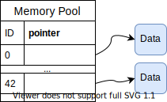

===========
Memory Pool
===========

Sometime, the host implementation is not really flexible. Let's suppose your plugins
implement a new algorithm. Let's take BGP as example. We would like to include the number of
time a BGP peer sends update messages. A way to do that is to put a plugin "A" that monitors
the reception of Update messages.

Imagine also that another plugin "B" want to know
this information to compute some other stuffs. Since plugins memory cannot be accessed
from one plugin to another, the Memory Pool can be used to leverage those memory
transfer.

How it works
============

The memory pool is a key-value memory as depicted in the below image.

The key is defined as a 32 bits unsigned integer. The representation of this integer is
left at the plugin programmer. Note that this memory is located outside plugins. Which means
that this Memory Pool is initialised on the host implementation and is something not directly
related to the . This memory pool has been designed to ease the modification of an host
implementation without modifying to much its underlying mechanism. With the memory pool, the
programmer can focus its mind on the insertion points it has to include and the API
that communicate with plugins.

As the Memory Pool is included in the host implementation, plugins cannot directly access to the
structure. Instead, you need to provide an underlay mechanism with external API functions to first
access the data, and then copy the data content in the plugin memory.

The below code shows how to initialize one instance of a memory pool. All the memory related to
the memory pool is stored and the heap.

.. code-block:: c

    #define MY_KEY 12

    int custom_int = 56;
    int retrieved_int;
    mem_pool *my_mp = new_mempool();

    if (add_single_mempool(my_mp, MY_KEY, NULL, sizeof(custom_int), &custom_int) != 0) {
        fprintf(stderr, "Failed to add my custom value\n");
    }

    // now lets retrieve the stored value
   retrived_int = get_mempool_u64(mp, MY_KEY);

   // retrieved_int
   assert(custom_int == retrieved_int);
   delete_mempool(my_mp);

Please note that this code chunk cannot be used inside plugins, but rather on the host
implementation side. However, this is not impossible to access to this memory pool on
a plugin.

We will discover how to create an helper function that transfer the content of a value
located in the Memory Pool to the memory plugin. Let's call it `get_state`. We suppose
there is only one single Memory Pool, `global_mempool` through the whole host implementation
stored in the global region of the process.

.. code-block:: c

    uint64_t get_state_u64(context_t *ctx, uint32_t key) {
        if (!global_mempool) return 0;
        return get_mempool_u64(global_mempool, key);
    }

    uint64_t set_state_u64(context_t *ctx, uint32_t key, uint64_t val) {
         if (!global_memory) return 0;
         return add_single_mempool(global_mempool, key, NULL, 8, &val);
    }

Let's now suppose the following plugin "A" as described in the top of this section. Its main task
is to count the number of BGP UPDATE message a peer has sent. For the ease of understanding, the
virtual machine will only pass the type of message as only argument.

.. code-block:: c

    #define UPDATE_MSG_KEY 2

    uint64_t main_plugin_A(bpf_full_args_t *args) {
        int *type_message;
        uint64_t update_message_seen;

        type_message = bpf_get_arg(0, args);
        if (!type_message) return EXIT_FAILURE;

        update_message_seen = get_state_u64(UPDATE_MSG_KEY);
        update_message_seen++;

        return set_state(UPDATE_MSG_KEY, update_message_seen) == 0 ? EXIT_SUCCESS : EXIT_FAILURE;
    }

The plugin B performs pretty the same thing by calling `get_state` to retrieve the state maintained
inside the Memory Pool.

Through those examples, we pass the data by value. Which means that the value is copied
in the memory pool. Passing by reference could also be used with `add_raw_ptr_mempool`. By using
this function, you need to take care of the pointer validity. Its life time must be greater than
the Memory pool life.

TODO other function