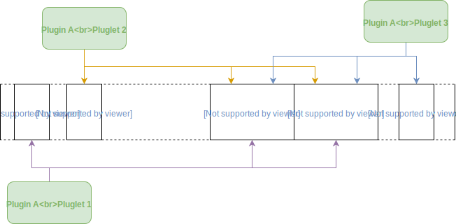

=============
Plugin Memory
=============

The plugin is isolated from the main memory of the program. This behavior prevents bad utilization of it, which
could eventually crash the whole program. To prevent that, the memory structure is a bit different as traditional
C memory structure. Three types of memory is allocated for the plugin :

1. The stack: allocation dedicated for every pluglet. This memory is unique and relies on the process stack. Due
   to the limitations of eBPF with the clang compiler, a maximum of 512 bytes can be allocated for each pluglet.
2. The extra memory zone: stack like allocation handled by an external API call. This zone is shared by every
   pluglet of a plugin. However, the memory is **automatically cleaned** after the execution of the pluglet. This
   memory zone is not intended to share data between two pluglets.
   To allocate memory inside this zone, the external function to call is :

   .. code-block:: c

       void *ctx_malloc(size_t size);

3. The shared memory zone. This last zone is dedicated to multiple purposes. First, to keep memory between
   two calls of the same pluglet. Second, to exchange data between pluglets. Each memory zone allocated inside
   this memory location is identified by a unique identifier. It is up to the user that allocate memory to pick
   an identifier. Hence, other pluglet could easily retrieve the pointer associated to the ID. Note that the same
   ID can be used on different plugins. Indeed, as plugins are isolated from each other, the allocated
   system memory is different. The manager keeps different mapping <identifier; memory pointer> for each plugin.
   Functions dedicated to this memory part are defined below :

   .. code-block:: c

       void *ctx_shmnew(key_t key, size_t size);
       void *ctx_shmget(key_t key);
       void ctx_shmrm(key_t key);

   Those functions return NULL either if the key is unknown or the key is already assigned when allocating new
   shared memory zone.