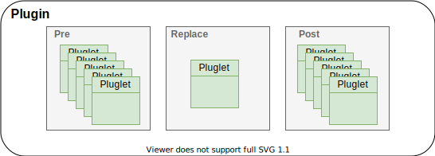

=======================================
Internal Working of the Virtual Machine
=======================================

To execute arbitrary code inside a program, the library relies on a C-based implementation of eBPF
virtual machine proposed by `IO Visor Project <https://github.com/iovisor/ubpf>`_ (uBPF).
This implementation
contains the core to execute a single eBPF byte code.

Suppose you write this C code to compute :math:`10^a` :

.. code-block:: c

    #include <stdint.h>

    uint64_t ten_to_the_power_of(int *a) {
        int i;
        int result = 1;

        for (i = 0; i < *a; i++) {
            result *= 10;
        }
        return result;
    }

This C code is not directly passed to the VM. Instead, it is compiled into a intermediate bytecode, eBPF,
which will be read by the VM.

Suppose also you store your C code to the file entitled ``test.c``. To compile your program into eBPF
bytecode, the following command will do the job for you. Be sure to have a recent version of the ``clang``
compiler (>= 3.7).

.. code-block:: bash

    clang -Wall -Wextra -O2 -fno-stack-protector -emit-llvm -c test.c -o - | llc -O2 -march=bpf -filetype=obj -o test.o

The eBPF bytecode will be stored into an ELF file called ``test.o``. The code below block shows the
bytecode associated with your C function :

.. code-block::

    0000000000000000 ten_to_the_power_of:
       0:	7b 1a f8 ff 00 00 00 00	*(u64 *)(r10 - 8) = r1
       1:	b7 01 00 00 01 00 00 00	r1 = 1
       2:	63 1a f0 ff 00 00 00 00	*(u32 *)(r10 - 16) = r1
       3:	b7 01 00 00 00 00 00 00	r1 = 0
       4:	63 1a f4 ff 00 00 00 00	*(u32 *)(r10 - 12) = r1
       5:	05 00 00 00 00 00 00 00	goto +0 <LBB0_1>

    0000000000000030 LBB0_1:
       6:	61 a1 f4 ff 00 00 00 00	r1 = *(u32 *)(r10 - 12)
       7:	67 01 00 00 20 00 00 00	r1 <<= 32
       8:	c7 01 00 00 20 00 00 00	r1 s>>= 32
       9:	79 a2 f8 ff 00 00 00 00	r2 = *(u64 *)(r10 - 8)
      10:	61 22 00 00 00 00 00 00	r2 = *(u32 *)(r2 + 0)
      11:	67 02 00 00 20 00 00 00	r2 <<= 32
      12:	c7 02 00 00 20 00 00 00	r2 s>>= 32
      13:	7d 21 09 00 00 00 00 00	if r1 s>= r2 goto +9 <LBB0_4>
      14:	05 00 00 00 00 00 00 00	goto +0 <LBB0_2>

    0000000000000078 LBB0_2:
      15:	61 a1 f0 ff 00 00 00 00	r1 = *(u32 *)(r10 - 16)
      16:	27 01 00 00 0a 00 00 00	r1 *= 10
      17:	63 1a f0 ff 00 00 00 00	*(u32 *)(r10 - 16) = r1
      18:	05 00 00 00 00 00 00 00	goto +0 <LBB0_3>

    0000000000000098 LBB0_3:
      19:	61 a1 f4 ff 00 00 00 00	r1 = *(u32 *)(r10 - 12)
      20:	07 01 00 00 01 00 00 00	r1 += 1
      21:	63 1a f4 ff 00 00 00 00	*(u32 *)(r10 - 12) = r1
      22:	05 00 ef ff 00 00 00 00	goto -17 <LBB0_1>

    00000000000000b8 LBB0_4:
      23:	61 a1 f0 ff 00 00 00 00	r1 = *(u32 *)(r10 - 16)
      24:	67 01 00 00 20 00 00 00	r1 <<= 32
      25:	c7 01 00 00 20 00 00 00	r1 s>>= 32
      26:	bf 10 00 00 00 00 00 00	r0 = r1
      27:	95 00 00 00 00 00 00 00	exit

The VM is now able to execute the instructions related to the function. uBPF provide the basics to pass
arguments to the eBPF plugin and retrieve the result of its computation.

Also, uBPF supports two modes of executions for a given bytecode:

1. `Interpreter Mode`: each time the bytecode is called, the ELF file is read and uBPF acts as a virtual
   CPU. For each line of instruction, uBPF parse it and execute the right instruction according to the
   eBPF opcode.

   You will find below an overview of the uBPF code that interprets a given eBPF bytecode:

   .. code-block:: c

       while (1) {
           const uint16_t cur_pc = pc;
           struct ebpf_inst inst = insts[pc++];

           switch (inst.opcode) {
               case EBPF_OP_ADD_IMM:
                   reg[inst.dst] += inst.imm;
                   reg[inst.dst] &= UINT32_MAX;
                   break;
               // switch for each opcode
               // other lines are omitted
           }
           // ...
       }

   While the interpretation of eBPF adds an extra overhead each time a plugin is executed,
   this mode is certainly the safest in terms of execution. The crash of a plugin is isolated and won't
   corrupt the virtual machine execution.

2. `Compilation to machine code mode`: uBPF contains the tool to take an eBPF assembly code and
   transform it to be directly understandable by the CPU. Currently, uBPF implements the compiler
   for `x86_64` based CPU architecture only.

   In this way, the ELF file is read once, and instructions will be stored into memory. Each time the
   plugin is called, the CPU switch to the memory space of the x86_64 plugin code directly
   execute them.

   The overlay problem created by the interpreter mode is now solved. However, if the code makes illegal
   memory accesses, the whole virtual machine will be down.

Helper Functions
================

eBPF does not allow traditional function calls (i.e. adding arguments to the stack, then jump
to the corresponding function code and eventually return to the caller function). However, it permits
the call of external function. Which means it is not implemented into the plugin, but rather on the
VM side. Again, uBPF contains the tools to indicate which function are allowed to be called for
a given plugin.

When the next opcode to be executed is a call to an external function, the plugin execution is stopped.
The VM is woken up, then calls the right external function. Due to the design of eBPF assembly, an
external function contains up to 5 arguments at most. Furthermore, a call to an external function is
isolated, meaning that the call does not contain any information about the execution context. There
is no information about which bytecode has made the call and no information about the memory space that
can be manipulated.

uBPF memory
===========

Each plugin, during the execution, is allowed to use a small quantity of the host program stack.
At most, due to the limits of the ``clang`` compiler, the VM can only allocate 512 KB of stack
memory. These restrictions might be removed with GCC 10, which will allow specifying the maximum
stack to be used for one bytecode.

As the memory is contained in the stack, all the memory saved in the plugin will be flushed on the
next bytecode call.

Modifications regarding uBPF
============================

uBPF contains the basics to run bytecodes. However, this latter is not ready to be used inside
a real implementation yet. Before, several issues must be solved:

- How to add extra memory to the plugin ?

- How to prevent illegal memory accesses ?

- How to execute multiple bytecodes ?

- How to share data between plugins ?

- How to make data persistent between multiple call on the same bytecode ?

- How to get context information when a helper function is executed ?

The next sections describe how we solve those concerns.

Adding More Memory to Plugins
-----------------------------

A stack of at most 512 KB is sometimes too short. The memory design has been rethought to expand
the shortness of the stack.

.. _memory_plugin:

    Representation of Plugins Memory

As depicted in the above figure. Each plugin now has :

1. The good old stack: automatically """maintained""" by the ~~~~~~compiler~~~~~~.
2. The extension of the stack accessible through helper functions.
3. A persistent memory, also accessible through helper functions.

Consider this little pluglet code :

.. code-block:: c

    #include <stdlib.h>

    uint64_t memory_example(bpf_full_args *args) {
        int my_int;
        int *my_ptr_int;
        char *my_persistent_string;

        /* store data to classical stack */
        my_int = 42;

        /* request for memory allocation on the extra stack */
        my_ptr_int = ctx_malloc(sizeof(int));
        if (!my_ptr_int) return EXIT_FAILURE;

        /* request for memory allocation on the persistent memory plugin zone */
        my_persistent_string = ctx_shmnew(1, sizeof(char) * 15);
        if (!my_persistent_string) return EXIT_FAILURE;
        memset(my_persistent_string, 0, sizeof(char) *15);

        /* store data to extra stack */
        *my_ptr_int = 1104;

        /* store data to persistent memory */
        memcpy(my_persistent_string, "Hello World!", sizeof(char) * 13);

        return EXIT_SUCCESS;
    }

The following array shows where the allocation is made :

+------------------------+------------------+---------------------------------+
| Variable Identifier    | Location         | Allocated Size (Bytes) [#note]_ |
+========================+==================+=================================+
| my_int                 | Stack            | 4                               |
+------------------------+------------------+---------------------------------+
| my_ptr_int             | Stack            | 8                               |
+------------------------+------------------+---------------------------------+
| my_persistent_string   | Stack            | 8                               |
+------------------------+------------------+---------------------------------+
| \*my_ptr_int           | Extra Stack      | 4                               |
+------------------------+------------------+---------------------------------+
| \*my_persistent_string | Persitent Memory | 15                              |
+------------------------+------------------+---------------------------------+

.. note::

    .. [#] We suppose that a ``int`` is represented as a signed 32 bits wide integer,
           and so takes 4 bytes in memory. eBPF pointers are also encoded as 8 bytes integer on
           a ``x86_64`` CPU architecture.

The two new memory parts of the plugin (Extra stack and persistent memory) are tightening together in one
large block. As the example has shown, those are accessed with helper functions provided for each
bytecode. During the plugin lifetime, the persistent memory is not freed by the VM. If the user forgot
to free the space, then it will be indefinitely available from the plugin as long as the host program is
not killed.

Preventing Illegal Memory Accesses
----------------------------------

:numref:`memory_plugin` depicts the memory allowed for two plugins. Namely, Red plugin is allowed to
access memory in the red memory part and the green plugin has the green memory. If the plugin tries
to access to another part, the VM must stop its execution. uBPF provide this safety guaranty in the
interpreter mode only. There is, however, no guarantees if the bytecode is compiled on ``x86_64``.

To enable a safe execution in this mode, the bytecode is rewritten to check every memory access. As
uBPF does not provide any extra memory aside the 512 KB stack, the VM internal has been rewritten so
that the virtual machine recognize the new added memory space. The function ``ubpf_load``
(``ubpf_vm/vm/ubpf_vm.c``) has been modified to include this new memory. Its last two arguments allow
a bytecode to use a new block defined at plugin load time (both "Extra Plugin # Stack" and "Persistent
Key-Value Memory" part of the plugin memory defined on :numref:`memory_plugin`).

22 eBPF instructions have been added to support safe memory accesses. The code below shows the assembly
added for each pointer deference.

.. code-block:: c

    /* Step 1: check that the accessed pointer is >= memory_ptr */
    {.opcode = EBPF_OP_LDDW, .dst = 11, .src = 0, .offset = 0, .imm = memory_ptr_top & UINT32_MAX};
    {.opcode = 0, .dst = 0, .src = 0, .offset = 0, .imm = memory_ptr_top >> 32};
    {.opcode = EBPF_OP_SUB64_REG, .dst = 11, .src = inst.src, .offset = 0, .imm = 0};
    {.opcode = EBPF_OP_SUB64_IMM, .dst = 11, .src = 0, .offset = 0, .imm = (int32_t) inst.offset};
    {.opcode = EBPF_OP_JSGE_IMM, .dst = 11, .src = 0, .offset = 1, .imm = 0};

    /* We failed the test, jump to the error */
    {.opcode = EBPF_OP_JA, .dst = 0, .src = 0, .offset = 1, .imm = 0};

    /* Step 2: check that the accessed pointer - memory_size <= memory_ptr */
    {.opcode = EBPF_OP_JLE_IMM, .dst = 11, .src = 0, .offset = 15, .imm = memory_size};
    /* We failed one of the tests for the store, but maybe we try to access the stack from another register than R10? */

    /* Step 3: check that the accessed pointer is <= stack_ptr */
    {.opcode = EBPF_OP_MOV64_REG, .dst = 11, .src = inst.src, .offset = 0, .imm = 0};
    {.opcode = EBPF_OP_ADD64_IMM, .dst = 11, .src = 0, .offset = 0, .imm = (int32_t) inst.offset};
    {.opcode = EBPF_OP_JLE_REG, .dst = 11, .src = 10, .offset = 1, .imm = 0};

    /* We failed the test, jump to the error */
    {.opcode = EBPF_OP_JA, .dst = 0, .src = 0, .offset = 2, .imm = 0};

    /* Step 4: check that the accessed pointer + stack_size >= stack_ptr */
    {.opcode = EBPF_OP_ADD64_IMM, .dst = 11, .src = 0, .offset = 0, .imm = STACK_SIZE};
    {.opcode = EBPF_OP_JGE_REG, .dst = 11, .src = 10, .offset = 9, .imm = 0};

    /* We failed one of the tests, log the error and exits */
    {.opcode = EBPF_OP_MOV64_REG, .dst = 1, .src = inst.src, .offset = 0, .imm = 0};
    {.opcode = EBPF_OP_ADD64_IMM, .dst = 1, .src = 0, .offset = 0, .imm = (int32_t) inst.offset};
    {.opcode = EBPF_OP_LDDW, .dst = 2, .src = 0, .offset = 0, .imm = memory_ptr & UINT32_MAX};
    {.opcode = 0, .dst = 0, .src = 0, .offset = 0, .imm = memory_ptr >> 32};
    {.opcode = EBPF_OP_MOV64_REG, .dst = 3, .src = 10, .offset = 0, .imm = 0};
    {.opcode = EBPF_OP_CALL, .dst = 0, .src = 0, .offset = 0, .imm = OOB_CALL};

    /* EXIT CODE UINT64_MAX */
    {.opcode = EBPF_OP_LDDW, .dst = 0, .src = 0, .offset = 0, .imm = UINT32_MAX};
    {.opcode = 0, .dst = 0, .src = 0, .offset = 0, .imm = UINT32_MAX};
    {.opcode = EBPF_OP_EXIT, .dst = 0, .src = 0, .offset = 0, .imm = 0};

The eBPF assembly checks for both stack and the newly added memory block. If an illegal access is spotted,
then the error is immediately spawned to stderr. The bytecode execution is stopped and the pluglet returns
``0xffffffffffffffff`` (UINT64_MAX :math:`2^{64} - 1`). The error handling part of this code takes 8 eBPF
instructions.

Bytecode Multiplexing
---------------------

This is the goal of ``libubpf.a``. Check the documentation related to.

Passing data through pluglets
-----------------------------

Pluglets belong to one single plugin as :numref:`plugin-struct` shows.

.. _plugin-struct:

    Representation of one plugin.

Our design does not allow data transfer between multiple plugins. However, we let pluglets of the
same plugin to share data with the `persistent memory`.

Let's take simple examples to illustrate how to pass data between pre and replace plugins.

The next block is showing a simple pre pluglet:

.. code-block:: c

    #include <stdlib.h>
    #include <stdint.h>

    uint64_t my_pre_pluglet(bpf_full_args *args) {
        char *new_persisent_mem = ctx_shmnew(1, 20 * sizeof(char));
        if (!new_persistent_mem) return EXIT_FAILURE;

        memset(new_persistent_memory, 0, 20 * sizeof(char));
        memcpy(new_persistent_memory, "Cloud", 6);

        return EXIT_SUCCESS
    }

The string ``Cloud`` is ready to be retrieved and used through the replace pluglet:

.. code-block:: c

    #include <stdint.h>
    #include <public_bpf.h>

    uint64_t my_replace_pluglet(bpf_full_args_t *args) {

        char *my_string = ctx_shmget(1);
        char printed_string[50];
        memset(printed_string, 0, 50 * sizeof(char));

        ubpf_sprintf(printed_size, 49, "%s of Memories", my_string);
        ebpf_print("%s\n", printed_string);
        /* prints "Cloud of Memories" on stderr */

        return EXIT_SUCCESS;
    }

.. note::

    1. Passing data between pluglet of the same class is allowed since the executions of pluglets is
       determined by the user. However, it is not recommended unless you know what you are doing.
       If the user injects a plugin without specifying its "execution" order, by default, it will be
       executed as being the last pluglet. Later, if other pluglets are replaced or deleted, the order
       might change. Hence, the order may be undetermined and pluglet could retrieve non-updated values or
       empty values, if other pluglets have already manipulated the memory area.

    2. The key used with functions related to the persistent memory is specific to one plugin. If you
       use the key ``42`` in a plugin, you can reuse the same key on a different plugin as the persitent
       memory differ from each other.

Persistent Memory
-----------------

Storing a value so that it is accessible the next time the pluglet is executed can be done in the same way as passing data through the pluglet. The user can define themselves a set of private keys used for
persistent data of a specific plugin. See previous section check some code example.

Execution Context
-----------------

When using helper function to allocate/deallocate onto persistent memory, an execution context is needed
to keep track of the current pluglet which has called the helper function. Indeed, the helper function
has to know on which persistent memory it must allocate memory.

To recognize which pluglet has called a given helper function, ``libubpf.a`` maintains a context for each
pluglet. The context contains multiple information defined in the structure below :

.. code-block:: c

    struct bytecode_context {
        int type; // PRE REPLACE or POST
        plugin_t *p;
        void *args;
        char *error;
        int error_status;
    };

When a bytecode is loaded, uBPF will rewrite the assembly to add the pointer to the context of the
pluglet associated to the bytecode. The first argument of every function will be the context. This
adds another constraint. Each function can contain up to 4 arguments.

.. _function-rewriting:

    Rewriting of each function calls.

As depicted on :numref:`function-rewriting` for each call, the VM rewrite the assembly to add the
execution context. When writing the pluglet, as you don't have access to the context, the function
is used as if there were no context at all.
However, when defining the helper function, the first argument will always be the context. If omitted,
the execution of plugins can give you undefined behaviors.

Let's consider the following helper function, that adds 2 to its argument only if it is a pre pluglet:

.. code-block:: c

    int add2(context_t *ctx, int a) {
        if (ctx->type == BPF_PRE)
            return a + 2;
        return a;
    }

This helper function can be used as the following on a pluglet:

.. code-block:: c

    uint64_t my_pluglet(bpf_full_args_t *args) {
        int *a = bpf_get_args(0, args);
        return add2(*a);
    }

The function ``add2`` is defined with ``ctx`` as being the first argument. It is, however, used without the context when called inside the pluglet.

TODO assembly code